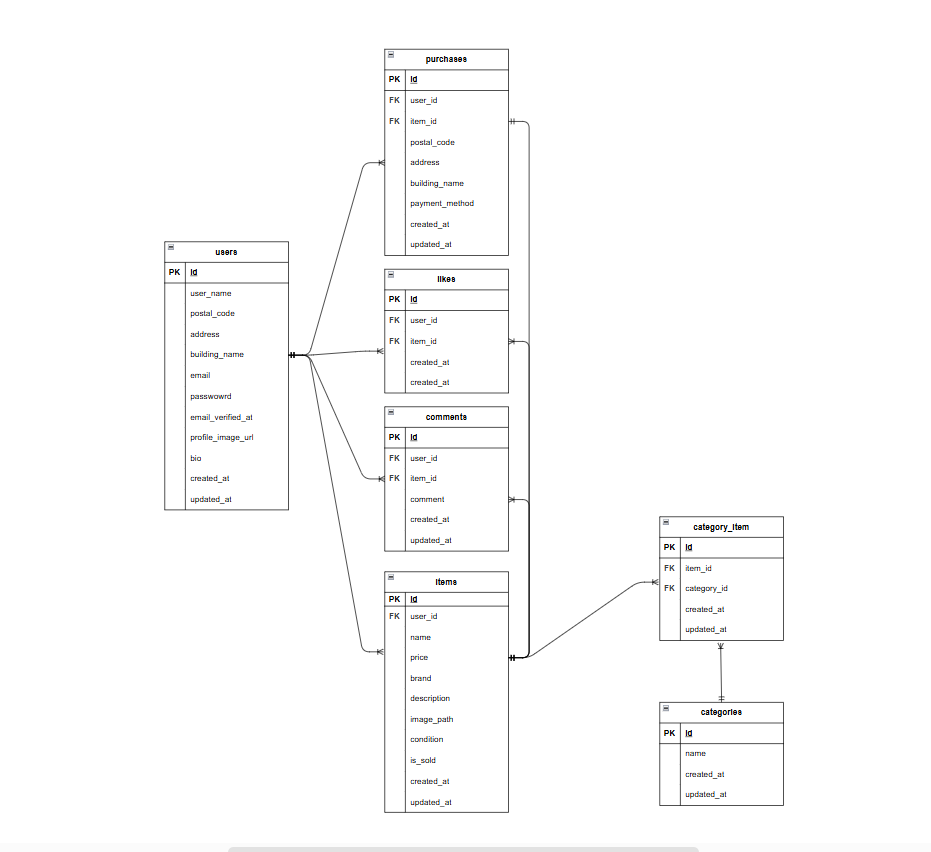

# coachtech　フリマアプリ

## プロジェクト概要
COACHTECH の課題として作成したフリマアプリです。
ユーザーは商品を出品・購入でき、いいねやコメント機能を備えています。
メール認証機能を実装しており、認証後のみ各種機能を利用できます。

---

## 使用技術（実行環境）
- PHP 8.1.33
- Laravel 8.83.8
- MySQL 8.0.x
- Docker / Docker Compose
- MailHog

---

## 環境構築

### Dockerビルド
1. `git clone git@github.com:o-emi/coachtech-flea-market-app.git`
2. `cd coachtech-flea-market-app`
3. Dockerアプリを立ち上げる
4. `docker-compose up -d --build`

---

### Laravel環境構築
1. `docker-compose exec php bash`
2. `composer install`
3. `.env` ファイルを作成します。

```bash
cp .env.example .env
```
または、新しく .env ファイルを作成し、
以下の環境変数を設定してください。


``` text
DB_CONNECTION=mysql
DB_HOST=mysql
DB_PORT=3306
DB_DATABASE=laravel_db
DB_USERNAME=laravel_user
DB_PASSWORD=laravel_pass
```
## Migration に関する補足（詳細）
マイグレーション実行時の注意点として、
本プロジェクトでは Doctrine DBAL を使用しています。

## 背景
Laravel では、既存カラム名を変更する際に
renameColumn メソッドを使用しますが、
Laravel の仕様上、この処理には Doctrine DBAL が必要となります。

本プロジェクトでは、テーブル設計の都合により
既存カラム名の変更を行っているため、
追加で Doctrine DBAL を導入しています。

## 対応方法
以下のコマンドを実行し、Doctrine DBAL をインストールしてください。
```bash
composer require doctrine/dbal:^3.0
```
※ Laravel と DBAL のバージョン互換性のため、3系を指定しています。

4. アプリケーションキーの作成
``` bash
php artisan key:generate
```

5. マイグレーションの実行
``` bash
php artisan migrate
```

6. シーディングの実行
初期データを投入します。
``` bash
php artisan db:seed
```

7. シンボリックリンク作成
画像ファイルを公開するため、シンボリックリンクを作成します。
``` bash
php artisan storage:link
```

## ログイン情報

※ 以下は Seeder により作成されているテストユーザー例です。
（実際の Seeder の内容に応じて修正してください）

### 一般ユーザー
- メールアドレス：test@example.com
- パスワード：password

### 管理者ユーザー（作成している場合）
- メールアドレス：admin@example.com
- パスワード：password

---

## メール認証について

本アプリでは、新規登録後にメール認証を行わないとログインできない仕様となっています。

### 開発環境でのメール確認方法

開発環境では MailHog を使用しています。

- 新規登録後、認証メールは MailHog に届きます
- メール内の「認証はこちら」リンクをクリックすると認証が完了します
- 認証完了後はプロフィール設定画面へ遷移します

---

## 認証が必要な機能

以下の機能はログインおよびメール認証後に利用可能です。

- 商品の出品
- マイページの閲覧・プロフィール編集
- 商品へのいいね
- コメント投稿
- 商品購入

---

## 初期データについて

本プロジェクトでは、商品データを Seeder により投入しています。

- ItemSeeder により商品一覧表示用のダミーデータが作成されます
- `is_sold` カラムにより Sold 表示の切り替えを確認できます

### 注意
`php artisan migrate:fresh --seed` を実行すると、
登録済みのユーザー情報・商品データはすべて削除されます。

---

## URL一覧
本アプリケーションで使用する各種 URL は以下の通りです。
### 開発環境
- アプリケーションURL
    http://localhost/
### データベース管理
- phpMyAdmin
    http://localhost:8080/
### メール確認
- MailHog
    http://localhost:8025/

---

## ER図

